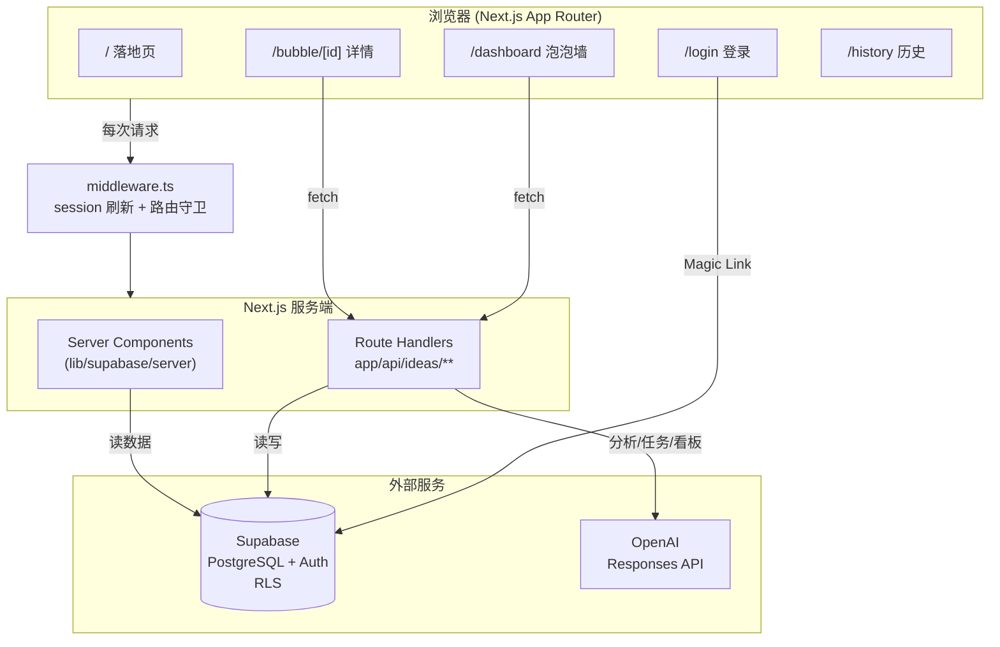
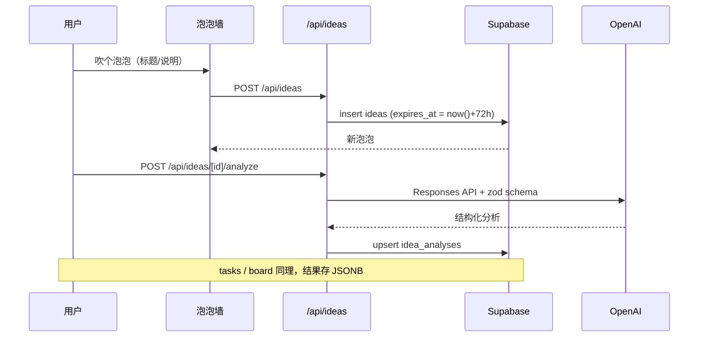
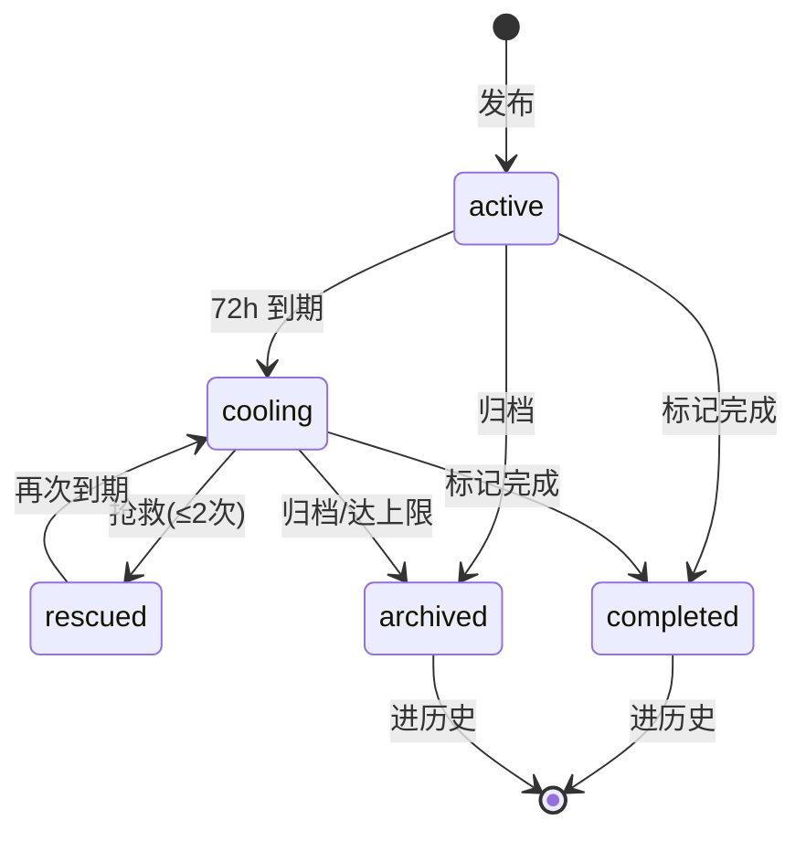

# 架构图 · 灵感缪斯

## 系统总览

```mermaid
flowchart TB
  subgraph Client["浏览器 (Next.js App Router)"]
    Landing["/ 落地页"]
    Login["/login 登录"]
    Wall["/dashboard 泡泡墙"]
    Detail["/bubble/[id] 详情"]
    History["/history 历史"]
  end

  MW["middleware.ts<br/>session 刷新 + 路由守卫"]

  subgraph Server["Next.js 服务端"]
    SC["Server Components<br/>(lib/supabase/server)"]
    API["Route Handlers<br/>app/api/ideas/**"]
  end

  subgraph External["外部服务"]
    SB[("Supabase<br/>PostgreSQL + Auth<br/>RLS")]
    AI["OpenAI<br/>Responses API"]
  end

  Client -->|每次请求| MW --> Server
  Detail -->|fetch| API
  Wall -->|fetch| API
  SC -->|读数据| SB
  API -->|读写| SB
  API -->|分析/任务/看板| AI
  Login -->|Magic Link| SB
```

## 发布与 AI 落地流程

```mermaid
sequenceDiagram
  participant U as 用户
  participant W as 泡泡墙
  participant API as /api/ideas
  participant DB as Supabase
  participant AI as OpenAI

  U->>W: 吹个泡泡（标题/说明）
  W->>API: POST /api/ideas
  API->>DB: insert ideas (expires_at = now()+72h)
  DB-->>W: 新泡泡
  U->>API: POST /api/ideas/[id]/analyze
  API->>AI: Responses API + zod schema
  AI-->>API: 结构化分析
  API->>DB: upsert idea_analyses
  Note over U,DB: tasks / board 同理，结果存 JSONB
```

## 泡泡状态机

```mermaid
stateDiagram-v2
  [*] --> active: 发布
  active --> cooling: 72h 到期
  cooling --> rescued: 抢救(≤2次)
  rescued --> cooling: 再次到期
  active --> completed: 标记完成
  active --> archived: 归档
  cooling --> completed: 标记完成
  cooling --> archived: 归档/达上限
  completed --> [*]: 进历史
  archived --> [*]: 进历史
```

> 渲染说明：以上为 Mermaid 图，GitHub / VS Code 可直接预览。
